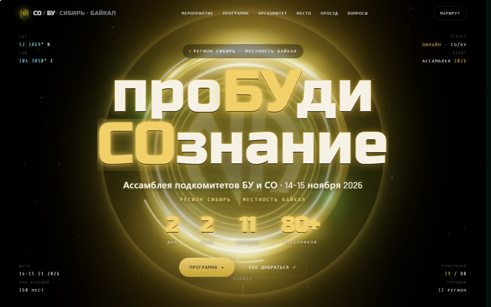

# 🕯️ Ассамблея СО/БУ — «проБУди СОзнание»

<p align="center">
  
</p>

<p align="center">
  <b>📍 Регион Сибирь · Местность Байкал · Иркутск</b><br>
  Ассамблея подкомитетов БУ и СО · <b>🗓️ 14–15 ноября 2026</b>
</p>

<p align="center">
  <code>2 дня</code> · <code>2 зала</code> · <code>11 городов</code> · <code>80+ участников</code>
</p>

---

## ✨ О проекте

Лендинг региональной ассамблеи подкомитетов **СО** (Связи с общественностью) и **БУ** (Больницы и учреждения) в Иркутске. Два дня живого общения, обмена опытом и служения — участники съезжаются из одиннадцати городов Сибири.

Сайт — **один самодостаточный HTML-файл** без сборки и зависимостей на сервере: весь CSS, JS и 3D-сцена лежат внутри `index.html`. Достаточно положить файл на любой статический хостинг — и всё работает.

## 🧩 Что внутри сайта

| Секция | Содержание |
|---|---|
| 🌌 **Hero** | 3D-сцена на Three.js: вращающееся кольцо с объёмными буквами N/A, звёздное поле, счётчики события и 4 CTA-кнопки («Программа», «Как добраться», «Анонсы канал», «Полезные ссылки») с золотым переливом |
| 📜 **Мероприятие** | Манифест ассамблеи — цели и смысл встречи |
| 🗓️ **Программа** | 5 этапов: заезд и открытие → параллельная работа залов СО и БУ → большое вечернее собрание → вечер (баня, караоке) → закрытие и выезд |
| 🤝 **Оргкомитет** | Карточки координаторов по направлениям (казначей, секретарь, дизайнеры, расселение, питание и др.) — клик открывает модалку с контактами и кнопками звонка/Telegram |
| 🏠 **Место** | Иркутск, мкр. Солнечный: большой зал на 160 мест + два малых зала (БУ и СО) по ~40 мест, проживание от 1 500 ₽/сутки, питание — столовая на территории |
| 🛏️ **Проживание и питание** | Отдельный блок с ценами за сутки; клик по карточке цены открывает те же модалки контактов, что и в оргкомитете |
| 🚆 **Проезд** | Ж/д-маршруты из 8 городов (Улан-Удэ, Красноярск, Чита, Томск, Новосибирск, Новокузнецк, Барнаул, Омск) + трансфер от вокзала и аэропорта |
| ❓ **Вопросы** | FAQ по регистрации, расселению и участию |

## 🛠️ Технологии

- **Чистый HTML / CSS / JS** — без фреймворков и без этапа сборки
- **Three.js r160** (через importmap): 3D-кольцо-логотип N/A с WebGL-рендером; при недоступности WebGL или `prefers-reduced-motion` подставляется статичный логотип-заглушка
- **Звёздный фон**: отдельный `<canvas>` — WebGL2/WebGL с деградацией до Canvas 2D
- **GSAP + ScrollTrigger** — анимации появления секций при скролле
- **Lenis** — плавный инерционный скролл
- **Общий CSS-класс золотого перелива** (`.btn--shine` / `.gold-shine`) — один переиспользуемый эффект (блик + пульсация рамки) на все CTA-кнопки и кнопки контактов, без дублирования стилей
- Адаптивная вёрстка (320–1440px+), магнитные кнопки, модальные окна контактов, Open Graph превью для соцсетей

## 🚀 Запуск локально

Нужен любой статический сервер в корне проекта, например:

```bash
python -m http.server 8765
```

Затем открыть <http://localhost:8765/index.html>.

> ⚠️ Открывать файл напрямую (`file://`) не получится — importmap и модули Three.js требуют HTTP.

## 📁 Структура репозитория

```
├── index.html                    # Весь сайт: разметка + стили + скрипты + 3D
├── assamblea-so-bu-deploy.html   # Копия index.html для деплоя (идентична)
├── og-image.png                  # Превью-картинка для соцсетей (Open Graph, 1200×630)
├── assets/
│   ├── preview.png               # Скриншот главного экрана (этот README)
│   ├── logo-na.png               # Логотип N/A
│   └── logo-na-transparent.png   # Логотип N/A на прозрачном фоне
├── na-logo-ref.png               # Референс логотипа (история дизайна)
└── README.md
```

## 📦 Деплой

Файл `assamblea-so-bu-deploy.html` — готовая к публикации копия `index.html`. Подойдёт любой статический хостинг: GitHub Pages, Netlify, Vercel или обычный веб-сервер — сборка не требуется.

Боевая версия опубликована на **[na-baykal-irk.ru](https://na-baykal-irk.ru/)**.

---

<p align="center"><i>🔥 Одна общая цель — нести весть.</i></p>
